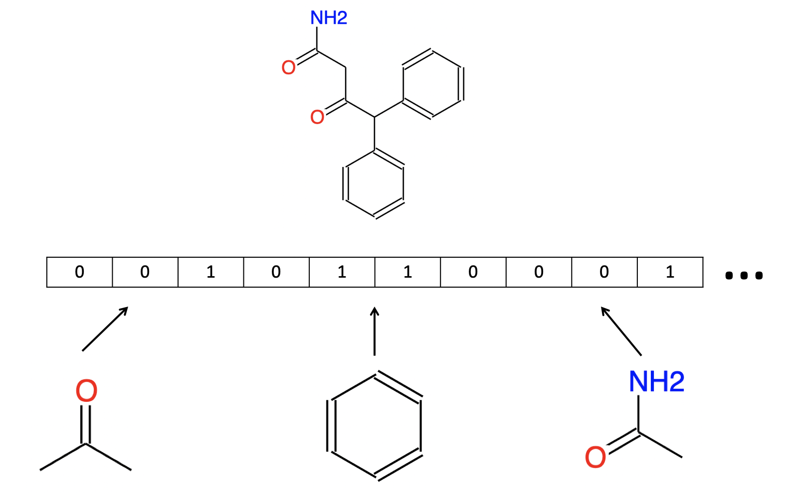
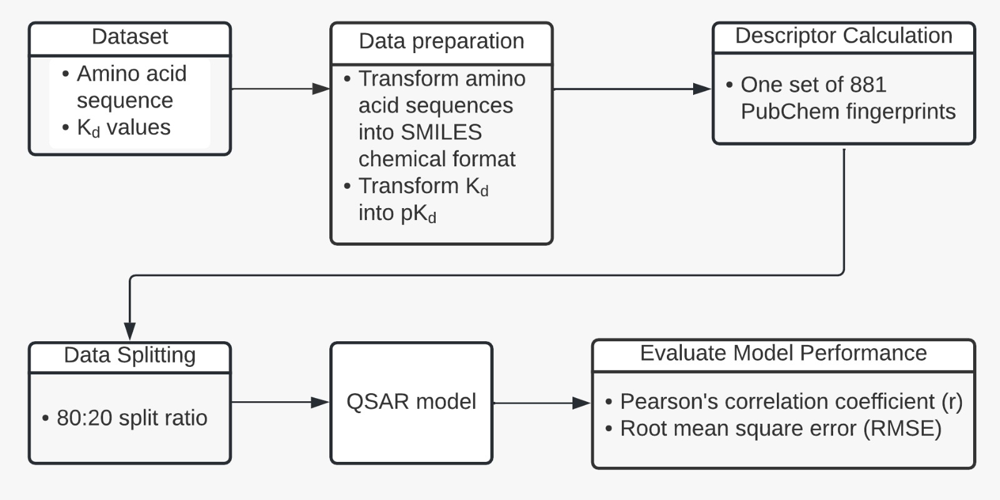
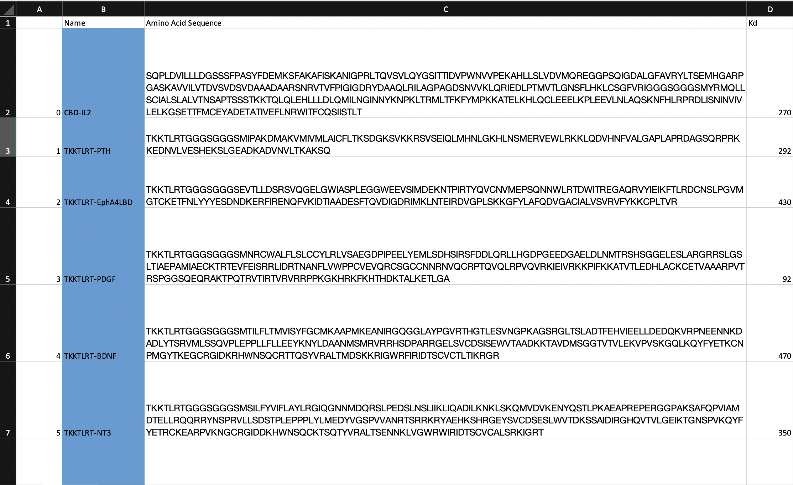

# deepBind

## Initial prototype of collagen binding affinity prediction program. 

### Authors: Piotr Gidzinski, Christopher Li, Iva Grujic, Rea Tresa, Shirin Bamezai, Lukenny Freire Tinta. 

Studying the drug-target interactions is crucial for finding new candidates and it can also be used to discover drugs for localised cancer immunotherapy.
Collagen binding drugs accumulate in the tumour stroma where they strongly bind to large amounts of leaked collagen, generating a gradient through which T cells can enter the tumour stroma and enhance antitumoral activity. Hence, proteins with a high affinity to collagen are key to finding future drug candidates. 

QSAR is a modelling method used to predict the biological activities of compounds of interest using machine learning methods. The approach is based on QSAR models for predicting drug activities using a Simplified Molecular Input-Line Entry System-based (SMILES) descriptors. Since no dataset of immunotherapeutic drug-target interactions currently exists, we propose a program that would compare different learning methods applied to the input data and select the most appropriate one.

MFP allows converting a molecular structure from the SMILES format into a bit string (Fig. 1). It is a useful method to describe the structural similarity among the compounds as a molecular descriptor, which can be implemented into machine learning. Out of two general ways of describing a structure with a fingerprint, sub-structure key-based fingerprints bring a lot of attention. They represent sub-structure features of the compound based on the list of structural keys. One of these methods, PubChem Fingerprints (PubChemFP), encodes 881 structural key types corresponding to the substructures for a fragment of all compounds in the PubChem database. For MFPs calculation, a built-in function of the PaDEL-Descriptor software was used. 

Figure 1: Schematic representation of a binary fingerprint representation of a chemical
structure. In PubChem, MFPs are used for similarity searching.

The goal of this work is to generate a program for two tasks:
1. To build a model from the dataset consisting of amino acids sequences of proteins and their Kd values obtained from measurements of binding affinity. 
2. To use the model to predict the Kd values of new candidates.

Figure 2: Workflow of QSAR modelling for investigation of collagen binding affinity.

## Usage 
### Building a model 

Currently, there program is not ready for compiling a big set of large proteins (>10K Da). It will run, but the calculation of descriptors takes a lot of time. For now, we suggest to 'add' every new molecule one by another to the dataset OR in small sets. 

- The input dataset should be in .xlsx format. 
- The input dataset should be saved in the same file as the repository (the repository needs to be installed locally first). 
- The input dataset should contain the column headers with the following names: 'Name', 'Amino Acid Sequence', 'Kd'. Make sure there is no space gap before or after the header title. 
- The first column should contain row indices. 

#### Example: 

1. Save the data containg 1 or more proteins in the file name 'your_input_file.xlsx'.
2. Run in the terminal 'fingerprint_calculator.py'.
3. Manually add the results from 'CollagenBindingProtein_data_pKd_PubChem_fp.xlsx' to your other personal file. 
4. Once all descriptors have been calculate, use build_model.py to select the best regresssion model and build it. 
5. The model is saved in the file 'CollagenBindingProteins_model.pkl' and ready to use.

As an example, we provide small dataset for free. Please, divide the dataset into a sets of 5 compounds and run the fingeprint calculations on them separately. 

### Prediction of unknown drugs 

If the model has been built and saved under the name as specified in the script, predict_in_one_go.py can be directly used. The result will be saved in the file 'prediction_output_data.xlsx'. 
- The input data needs to be in the structure as with the input dataset, except there is no column for 'Kd'. 
